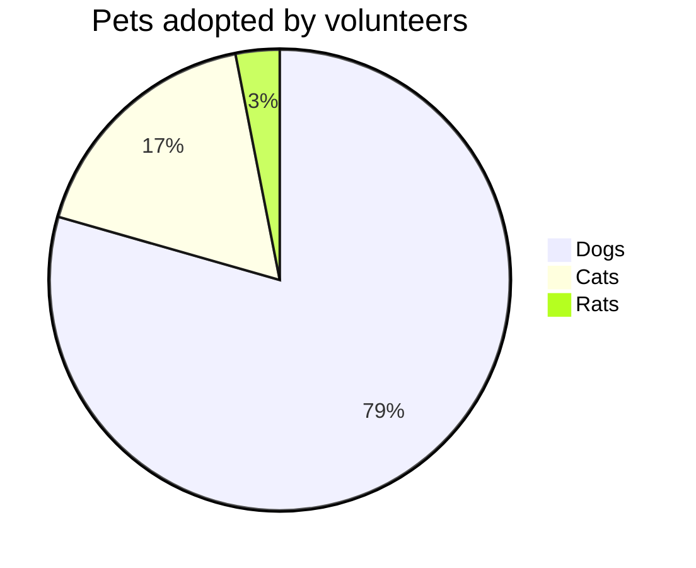

# 📦 Proyecto Laravel: [Nombre del Proyecto]

**Descripción**:
_Descripción breve del proyecto, especificando su propósito, las funcionalidades principales y el valor que aporta._

---

## 🌐 URLs del Proyecto

- **Repositorio Principal**:
  [https://github.com/[usuario]/[nombre-proyecto]](https://github.com/[usuario]/[nombre-proyecto])

- **Backlog (GitHub Projects)**:
  [https://github.com/[usuario]/[nombre-proyecto]/projects/1](https://github.com/[usuario]/[nombre-proyecto]/projects/1)

- **Issues**:
  [https://github.com/[usuario]/[nombre-proyecto]/issues](https://github.com/[usuario]/[nombre-proyecto]/issues)

## 🔧 Instalación y Configuración

- **Instalación**:
  _asegúrate de tener instalado [Doravel](https://github.com/byancode/doravel) en tu sistema:_
  ```bash
    curl -L "https://raw.githubusercontent.com/byancode/doravel/develop/scripts/install" | bash
  ```
  _ahora puedes clonar el repositorio del proyecto y ejecutar el script de instalación:_
  ```bash
    gh repo clone byancode/[nombre-proyecto]
    cd [nombre-proyecto]
  ```

- **Configuración**:
- Ejecutar las migraciones y seeders:
  ```bash
  ./doravel setup
  ```

## 🚀 Deploy proyecto

- **Instalación**:
  _Copiar y pegar el siguiente comando en la terminal:_
  ```bash
    curl -L "https://raw.githubusercontent.com/[usuario]/[nombre-proyecto]/main/deploy" | bash
  ```

## 📊 Charts

